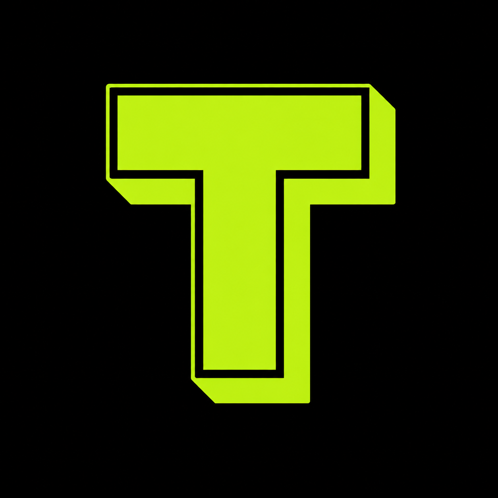

<p align="center">
  
  <h1 align="center">Tabot</h1>
  <p align="center">
    <a href="https://github.com/Shanvit7/tabot/blob/main/LICENSE"></a>
    
    
  </p>
</p>

> Every digital worker needs a memory.

Tabot is a local-first work-memory layer for people who do their work in a browser — founders, operators, researchers, marketers, designers, support teams, and developers. It turns local browser activity into structured, portable context you own, so you, an AI assistant, or any future tool can pick work up without rebuilding it from scratch.

**Experimental · Open source · Local-first · MIT**

---

## Why

Digital work happens across tabs. A researcher follows sources. An operator moves from inbox to document to dashboard. Browser history can answer:

> What pages did I visit?

It cannot reliably answer:

> What work was this part of, and where did I leave off?

Tabot uses sequence and relationships between browser activity to preserve evidence of that work. It does not claim to read your mind or decide what your work meant. It gives you — or an AI you choose — enough context to pick it up later.

## How it works

```text
Browser events
     ↓
Sessions
     ↓
Activity anchors
     ↓
Temporal graph
     ↓
Activity episodes
     ↓
Contexts
     ↓
Behavioral memories
```

The graph is evidence for relationships between activity. Chronological order remains the constraint for activity segmentation, and the derived layers are rebuildable from the underlying telemetry.

## Bring your own AI

Tabot does not own the intelligence layer. It is context infrastructure for every digital worker, whatever tools they use. Use exported data with ChatGPT, Claude, Gemini, local models, your own agent, your own scripts — or no AI at all.

**your data → your context → your choice of AI**

## Local-first

The core telemetry and derivation run locally. There is no Tabot cloud required for the core pipeline, and you control when data is exported.

Browser telemetry is sensitive. Even without page contents, URLs, domains, timestamps, and activity patterns can reveal a lot about someone. Treat exports as personal data.

## Export

The canonical export is **JSONL with a manifest**. The manifest describes the export and its schema/derivation versions; the remaining lines contain the canonical event and derived records, preserving provenance through IDs.

The export is intended to be human inspectable, scriptable, reproducible, portable, and usable by AI agents. The exact schema is documented in the repository's export specification and may evolve while Tabot is experimental.

## What Tabot can and cannot know

Tabot can preserve evidence such as:

- where activity happened;
- when it happened;
- which browser activities were connected;
- how activity moved between pages;
- which patterns recurred.

It cannot reliably know:

- what you were thinking;
- why you opened a page;
- what you intended to accomplish;
- whether an activity was productive;
- the meaning of content it did not capture.

Those are inferences for downstream analysis, not facts recorded by Tabot.

## Privacy

Tabot is intended to work from browser activity signals rather than indiscriminately capturing page contents, passwords, or typed text. The exact telemetry available depends on the browser APIs used by the extension. Because telemetry can still be sensitive, privacy is treated as a product constraint rather than an afterthought.

## Get started

Currently experimental. Typical development commands:

```bash
pnpm install
pnpm lint
pnpm typecheck
pnpm test
```

Check the repository's package scripts for the current build and extension-development commands.

## Roadmap

The near-term focus is deliberately narrow:

- stabilize the telemetry/export format;
- improve the usefulness of derived context;
- evaluate AI inference against real examples;
- explore additional browser lifecycle signals where they solve a demonstrated limitation;
- make the export increasingly useful to external AI agents and local models.

## Contributing

The project is still early. Useful contributions include:

- browser telemetry
- privacy improvements
- export/schema tooling
- deterministic derivation tests
- visualization
- AI integrations
- local-model integrations
- analysis tooling
- documentation

For algorithmic changes, include a concrete failure case and a way to measure whether the change actually improves the result.

---

## License

MIT License. Copyright (c) 2026 Shanvit Shetty. See [`LICENSE`](LICENSE) for the full license text.
