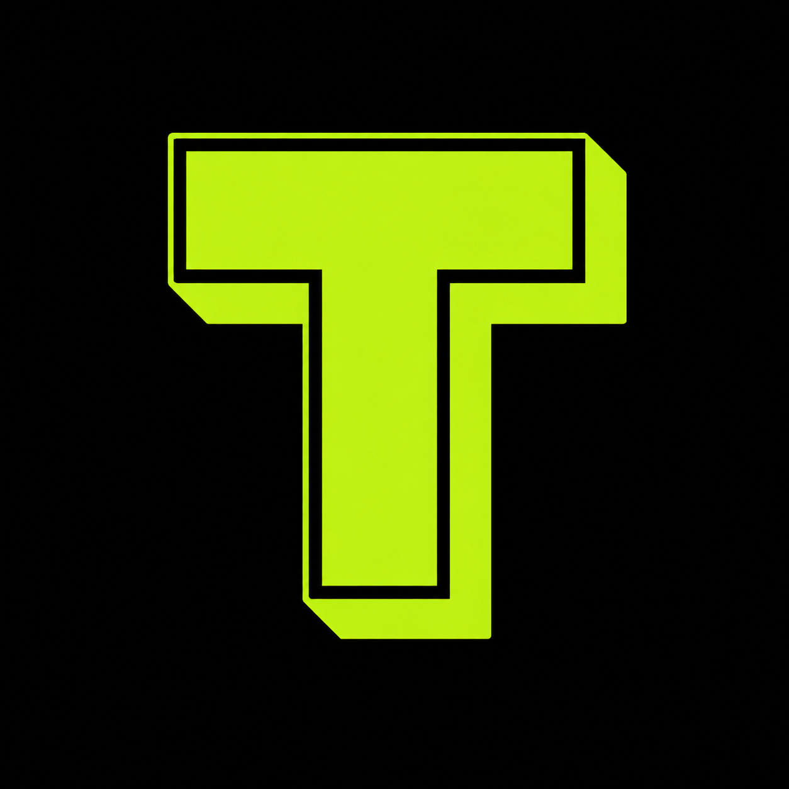

<p align="center">
  
  <h1 align="center">Tabot</h1>
  <p align="center">
    <a href="https://github.com/Shanvit7/tabot/blob/main/LICENSE"></a>
    
    
  </p>
</p>

> Your browsing day, made visible.

Tabot is a Chrome extension and dashboard that turns your browsing activity into a visual map you can explore. See which sites you visited, how your browsing moved between them, and what patterns keep showing up.

**Open source · Private by design · MIT**

---

## Your activity, easier to follow

A workday can move from email to a document, a search, and a dozen other sites. Browser history gives you a list; Tabot lays those visits out so you can follow your day.

Explore a visual map of the sites you visited and the paths between them. Look back over time and notice which sites or routes keep reappearing. Tabot shows recorded activity—not what you were thinking, what a visit meant, or whether the work was productive.

## How it works

1. **Browse in Chrome.** The extension records visited sites and browser activity signals on your device.
2. **Explore your activity.** Open the dashboard to see your browsing as a map and timeline, then follow site connections and recurring patterns.

## Privacy and your data

Your browsing record stays on your device for local review. Tabot does not need an account or cloud history sync. When you ask ChatGPT about your activity, its Tabot plugin can request selected results from your extension, such as browsing-context details or site and activity counts. Tabot's online MCP connection service passes requests and results between ChatGPT and the extension; it does not save browsing history or tool results in its application storage. ChatGPT receives the requested results and handles them under OpenAI's data policies.

Tabot does not record page contents, typed text, passwords, or form values. Even site names and timestamps can be sensitive, so treat any activity data you share or export as personal.

## ChatGPT integration

When connected, ChatGPT's Tabot plugin can request selected, sanitized results from the extension—for example, browsing contexts, recurring-pattern details, or activity metrics. The extension reads and prepares each result locally; raw event history is not sent to the online MCP connection service. You can explore your activity in the dashboard without this connection.

## Keep a copy

You can download a JSONL copy for your own review or audit. It includes a manifest and records with their IDs and provenance. Export is a secondary way to keep or inspect your data; the dashboard is where you explore your activity.

## What Tabot can and cannot know

Tabot can preserve evidence such as:

- where activity happened;
- when it happened;
- which browser activities were connected;
- how activity moved between pages;
- which patterns recurred.

It cannot reliably know:

- what you were thinking;
- why you opened a page;
- what you intended to accomplish;
- whether an activity was productive;
- the meaning of content it did not capture.

Those are inferences for downstream analysis, not facts recorded by Tabot.

## Run the project

Typical development commands:

```bash
pnpm install
pnpm lint
pnpm --filter mcp-server typecheck
pnpm --filter shared check:retrieval
```

To develop or test the ChatGPT connection, follow [MCP relay setup and troubleshooting](apps/mcp-server/README.md). The connection requires the extension and ChatGPT to use the same Chrome profile. Check package scripts for other build and extension-development commands.

## Roadmap

The near-term focus is deliberately narrow:

- stabilize the telemetry/export format;
- improve the usefulness of derived context;
- evaluate AI inference against real examples;
- explore additional browser lifecycle signals where they solve a demonstrated limitation;
- make activity easier to explore and understand.

## Contributing

The project is still early. Useful contributions include:

- browser telemetry
- privacy improvements
- export/schema tooling
- deterministic derivation tests
- visualization
- AI integrations
- local-model integrations
- analysis tooling
- documentation

For algorithmic changes, include a concrete failure case and a way to measure whether the change actually improves the result.

---

## License

MIT License. Copyright (c) 2026 Shanvit Shetty. See [`LICENSE`](LICENSE) for the full license text.
